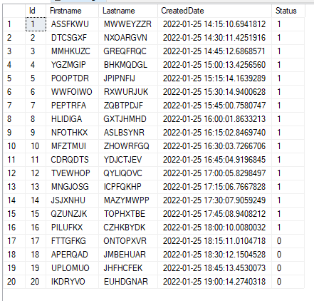

# Sodexo .NET Bootcamp - Fourth Homework

### Details

- Deadline: 26 Jan 2022
- [Details of homework](https://github.com/Semra4141/UcuncuHaftaOdevi/files/7918753/Odev.4.0.pdf)

#### Observation of Hangfire Jobs

I started the app at 02:00 PM and waited until daily update.
 

1. At the beginning, I sent the requests for adding recurring jobs.

  

2. First job that I added to Hangfire, was inserting a record in every 15 minutes. 

The situation of table until daily update, you can see that the job is inserting a record in every 15 minutes correctly.

  

Successed jobs until daily update.

  

3. When it comes to the daily update (06:00 PM), status of the records on table should be updated.

Table situation during daily update.

  

Successed jobs during daily update.

  

4. After the daily update, first job kept inserting records.

  

